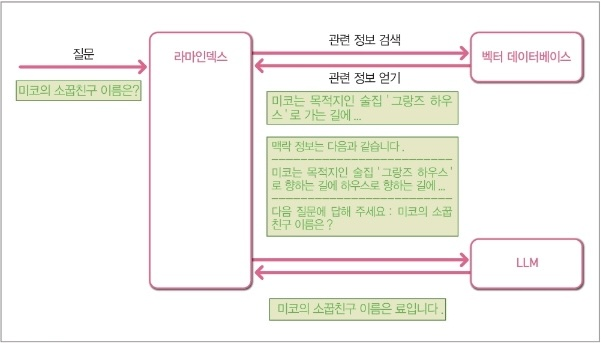

# 5장. 라마인덱스

## 5-1. 라마인덱스 시작하기
### 라마인덱스란?
LLM의 인풋으로 들어가는 데이터들 외부에서 가져와 사용할 수 있도록 돕는 개발 프레임워크이다.단순히 텍스트형태의 데이터들 뿐만이 아니라, PDF, 웹페이지,유튜브영상의 자막 등을 가져와서 사용할 수 있다.

### LlamaIndex의 뜻이 무엇일까? 
LlamaIndex = LLM + A + Index
- LLM: Large Language model로 수많은 "공개되어 있는" 문서들을 학습한 자연어 처리 모델을 의미한다.
- A: LLM을 보고 발음이 유사한 LAMA를 떠올리고 이 프레임워크를 대중화 시키기위해 해당 동물의 이미지를 사용하기로 결정하면서 LLM 문자 사이에 A를 넣어 Llama로 표기한 것은 아닐까?
- INDEX: 데이터를 구조화하고 검색가능하게 만드는 방법

### LlamaIndex의 작동원리
라마인덱스를 활용하는 서비스 작동원리를 아래와 같이 정리해보았다. 
1. 먼저 서비스 사용자의 질문을 입력받는다. 
2. 그다음, 입력된 질문과 연관된 데이터들을 벡터 데이터 베이스에서 검색해 찾아낸다. (벡터 데이터베이스에는 LLM이 학습하지 못한 비공개 데이터가 저장되어있다)
3. 질문과 연관된 데이터들을 추출한 뒤에는, 이 데이터와 사용자의 질문을 LLM에 전달한다. 
4. LLM은 추론 기능을 활용해 답변을 생성하고 
5. 이 결과가 사용자에게 정보로 제공되는 방식으로 동작한다.
+ 질문입력으로 벡터데이터 베이스에서 데이터를 검색할때는 질문을 벡터형태로 임베딩하고 임베딩된 결과를 백터데이터 베이스의 데이터와 비교하면서 연관된 정보들을 찾아낸다.

### LlamaIndex 실습
[colab링크: LlamaIndex실습](https://colab.research.google.com/drive/1DGcM7dJFUGRWnqu549udFWz9g23088P3?usp=sharing)

## 5-2. LlamaIndex 세부 기능
### LlamaIndex 생성철차 
- 각 단계는 세부조정가능하다. 자세한 것은 공식문서 참조 
1) 데이터 가져오기
2) LLM 연결하기
3) 데이터 임베딩하기 (인덱스 만들기)
4) 임베딩된 데이터(인덱스)를 저장소에 저장하기
5) 인덱스로 쿼리엔진만들기
6) 세부 조정된 쿼리 날리기

### 라마인덱스의 인덱스 종류
1) 벡터 스토어 인덱스: 각 노드와 해당 임베디드를 벡터 스토어에 저장하는 인덱스
2) 리스트 인덱스: 노드를 리스트 구조로 저장하는 인덱스
3) 트리 인덱스: 노드를 계층적 트리구조로 구축
4) 키워드 테이블 인덱스: 각 노드에서 키워드 추출하고 각 키에 대해 단어에서 해당 노드에 대한 링크를 구축하는 인덱스

## 5-3. 라마허브
라마 허브에서 제공하는 데이터 커넥터를 활용하여, 텍스트 문서 뿐만아니라, 유튜브, 슬랙, PDF 등등 다양한 형태의 데이터를 소스로 활용할 수 있다.

## 5-4. 벡터 데이터 베이스 
데이터를 임베팅해서 저장하여 벡터 공간 내에서 빠른 검색을 구현하기 위한 데이터베이스이다.